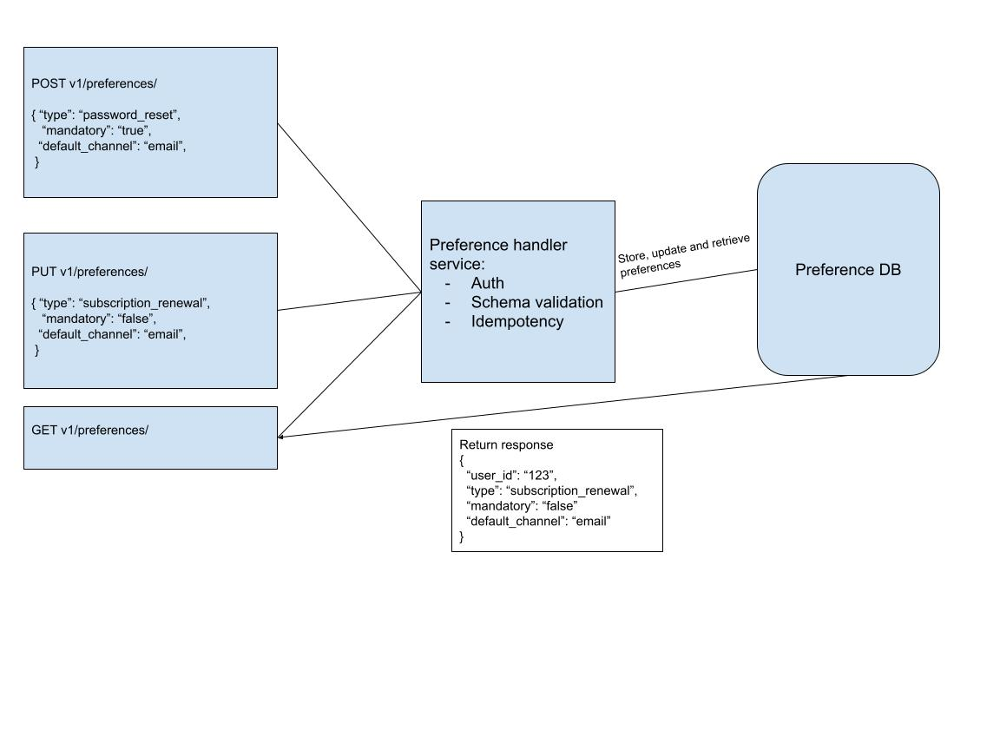

## Event Driven Notifications Platform
A unified, reliable mechanism for delivering user notifications from across different services with minimum latency

### REST API DESIGN
Example design for one of the API's `/preferences`

#### AUTHENTICATION DESIGN & TOOLS FOR MAKING THE ENDPOINTS PROTECTED
    
- I have used AUTH0 as the authentication provider and Redis as the centralized credentials store
- I have chosen to call the API from regular web apps using the Authorization Code Flow.
- Ref: https://auth0.com/docs/get-started/authentication-and-authorization-flow/authorization-code-flow/call-your-api-using-the-authorization-code-flow#request-tokens
- So to verify this flow the first step is to GET http://localhost:8000/api/v1/auth/login 
- Then an auth0 managed login page will open and a registered user will accept the login prompt 
- Then they will be redirected back and the `def auth_callback()` function will exchange the code for an access token
- That access token will be stored in the Redis key-value store to be used for longer session usage with a TTL of 1 hour
- Then the `def get_current_user()` will return the authenticated user which will be used via dependency injection in all API requests

### TECH STACK

- FastAPI for building REST Endpoints
- AUTH0 for auth identity provider
- Redis as a credential store
- AWS DynamoDB as the data store
- Kafka as event streaming messaging system
- #TODO: Add more as we develop

    
### TODO: Explain the Project structure and flow 
### TODO: Explain how to test?